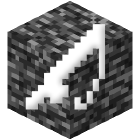

## mcbe-fisher-rs 

[](https://github.com/z1xus/mcbe-fisher-rs/releases)
[](https://github.com/z1xus/mcbe-fisher-rs/issues)
[](https://github.com/z1xus/mcbe-fisher-rs/pulls)

First ever *almost* internal Minecraft Bedrock Edition fishing bot.

### Disclaimer
**Use at Your Own Risk:** This fishing bot is a tool designed for automation and convenience. Using such tools can be considered cheating or against the rules on many public servers. Always check and adhere to the rules of the server or community you are engaging with before using this bot.

### Support
The bot has been tested only on Minecraft Bedrock v1.21.2 Build 25836796, the offsets may be invalid for other versions.

### Configuration
* **Casts:** The number of casts to make before stopping. Defaults to infinite.
* **Threshold:** The delay before reeling the rod in. Defaults to 1.

Note: The settings are not being stored, so you will have to set them every time you start the bot.

### Usage
1. Download the latest release from the [Releases](https://github.com/z1xus/mcbe-fisher-rs/releases) page.
2. Run the executable.
3. You will be presented with a GUI, simply click on the "Start fishing" button to start fishing.

### Building
1. Clone the repository
```bash
git clone https://github.com/Z1xus/mcbe-fisher-rs
```
2. Build a release binary
```bash
cargo build --release
```
3. The binary will be located in the `target/release` directory

### License
This project is licensed under the GPL-3.0 License - see the [LICENSE](LICENSE) file for details.

### Contributing
Since I haven't yet figured out how to send inputs directly to the game, I would appreciate any help with that! Pull requests are welcome.
